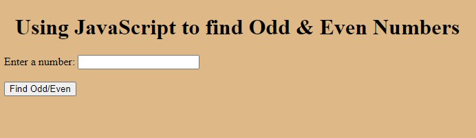

<h1>Determining if a number is Odd or Even</h1>

A simple program which helps determine if a number is odd or even

This program performs basics functions such as:

<ul>
    <li>Prompting a user to enter a number</li>
    <li>Determining if the number entered is odd or even</li>
</ul>

This programs functionality was achieved using JavaScript

<h1>Steps to execute this program</h1>
<ul>
    <li>Open up the index.html</li>
</ul>
<h1>Technologies used:</h1>
<ul>
    <li>HTML</li>
    <li>CSS</li>
    <li>JavaScript</li>
</ul>